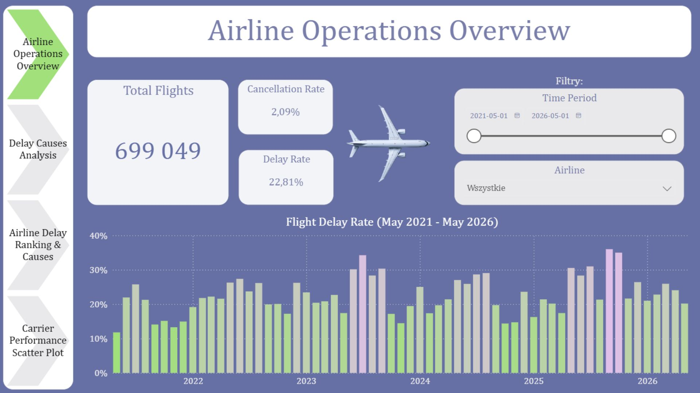
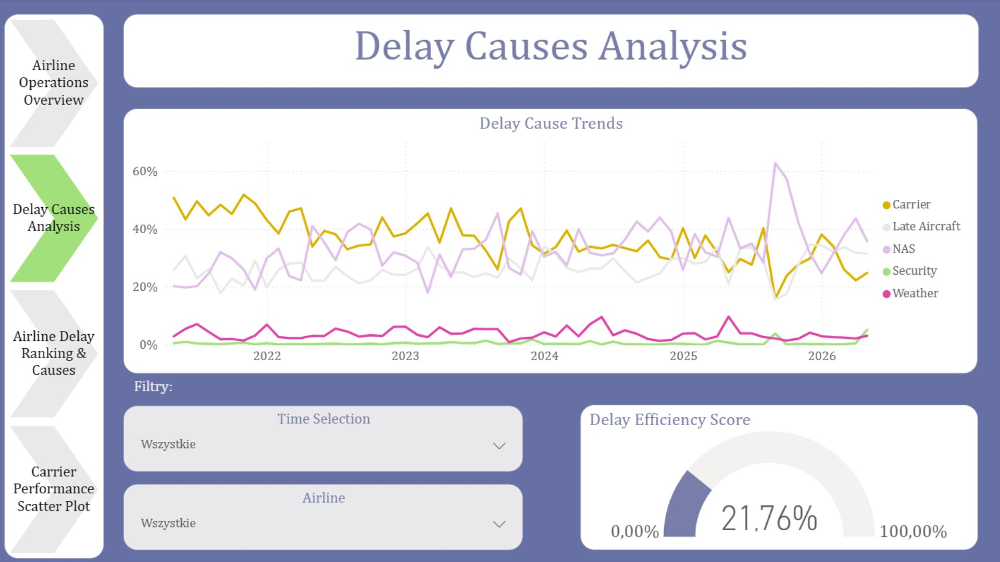
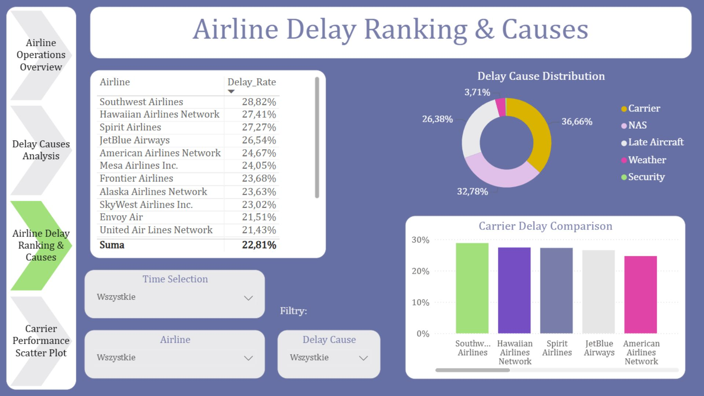
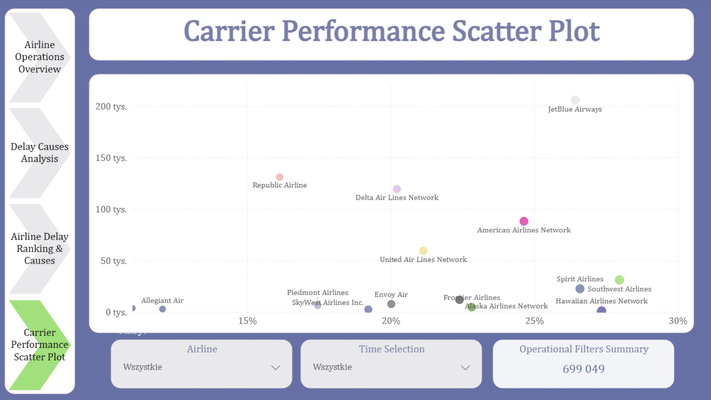

**Airline Operations Performance Dashboard**'

### Airline Operations Overview

**Project Overview**

This project is an interactive Power BI dashboard built to analyze airline operational performance using flight delay data.
The goal is to understand flight punctuality, delay causes, carrier performance, and temporal patterns of disruptions at a major US airport (Boston Logan International Airport).

The analysis focuses specifically on:

flight punctuality (delays ≥ 15 minutes),
cancellation rates,
delay causes distribution,
carrier-level performance comparison,
time-based trends of delays and disruptions.

The dataset was prepared from raw flight records sourced from an aviation performance database and transformed using SQL to focus on delay-related metrics.

**Business Questions**

The dashboard was designed to answer the following questions:

What are the main causes of flight delays?
Which carriers experience the highest delay rates?
How do delay causes differ between airlines?
Are there visible time-based trends in delays and cancellations?
How does operational performance vary across carriers?

**Dataset Description**

The dataset contains 845 records and includes operational data for 14 airlines operating flights to Boston Logan International Airport between May 2021 and May 2026.

The data covers key flight performance indicators such as the number of arrivals, delayed flights, cancelled flights, and detailed breakdowns of delay causes. Additional information included diverted flights; however, this metric was excluded from the analysis to keep the focus on flight punctuality and delay-related performance.

While diverted flights were present in the original dataset, cancelled flights were significantly more frequent and were therefore included in the analysis and visualized in the dashboard.

The main objective of the dataset preparation was to analyze the causes of non-punctual arrivals and identify whether delays are influenced by temporal factors such as year, month, or seasonality, as well as operational factors such as carrier workload (number of flights) and delay rates.

During data exploration, one outlier was identified: a carrier that operated only a single recorded flight at the airport and had a 100% delay rate. This observation was excluded from some visualizations to avoid distortion of aggregated results. However, the delay cause information for this record was still included in relevant breakdown analyses.

The dataset includes aggregated monthly airline performance data with the following dimensions:

Key dimensions:

Carrier (airline code and name)
Airport (Boston Logan International Airport)
Time (year, month)

Key metrics:
  Total number of flights
  Number of delayed flights (≥ 15 minutes)
  Number of cancelled flights

Delay cause breakdown:
  Carrier-related delays
  Weather-related delays
  NAS (National Air System) delays
  Security delays
  Late aircraft delays
  
Delay minutes by category

Additional columns such as diverted flights and total delay minutes were intentionally excluded to focus the analysis on delay causes and punctuality performance.
The analysis focuses on delay rates (flights delayed by 15 minutes or more), which is a standard metric used in aviation performance reporting.

**Data Model & Transformation**

The data was processed using SQL before visualization.

Key transformations:

creation of delay ratios (e.g. delay_ratio, cancellation_ratio)
calculation of delay cause shares
normalization of metrics for comparison across carriers and time
unpivoting delay cause columns to enable categorical analysis in Power BI

This structure allows flexible slicing by:

carrier
time (year/month)
delay cause category

**Dashboard Structure**

The solution consists of four interactive pages:

1. Airline Operations Overview

This page provides a high-level summary of airline performance.

Visuals:

Total number of flights (KPI)
Percentage of delayed flights
Percentage of cancelled flights
Monthly trend of delay rate (column chart)
Time and carrier slicers

2. Delay Causes Analysis

This page focuses on understanding why delays occur.

Visuals:

Line chart showing delay causes over time
Gauge / semi-circle KPI for delay performance
Slicers: carrier, time (year/month)

3. Airline Delay Ranking & Causes

This page compares carriers and breaks down delay reasons.

Visuals:

Carrier ranking table with conditional formatting (traffic-light indicators)
Pie chart showing distribution of delay causes
Column chart of carriers ranked by delay percentage
Slicers: carrier, time, delay cause

4. Carrier Performance Scatter Plot

This page analyzes operational efficiency at a deeper level.

Visuals:

Scatter plot:
X-axis: total number of flights
Y-axis: delay percentage
Bubble size: volume or performance indicator
Carrier filter
Time filter
KPI card showing total flights

### Delay Causes Analysis

### Airline Delay Ranking & Causes

### Carrier Performance Scatter Plot

**Tools & Technologies**

SQL Server (data transformation & views)
Power BI (data modeling & visualization)
Power Query (data cleaning)
DAX (calculated measures & KPIs)

**Project Goals**

The main objective of this project is to simulate a real-world airline operations analysis dashboard that could be used by airport management or airline operations teams to:

monitor punctuality performance,
identify systemic delay causes,
compare airline efficiency,
detect operational trends over time.

**Repository Structure (planned)**

/sql
/powerbi
/screenshots
/docs
README.md
